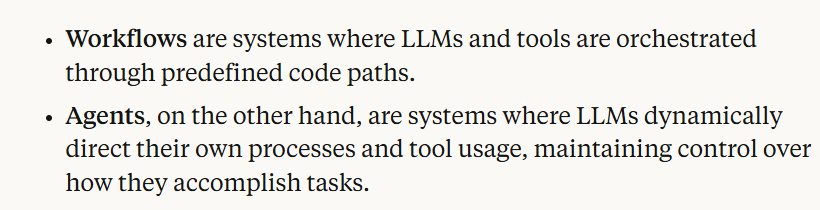
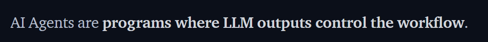

# Welcome

Implementing Agentic AI Solutions in Python from scratch

The repo is here: https://github.com/Python-Test-Engineer/conf42-ai-agents

And I will be using NOTES.md for this talk along with code and the talk will be mostly code walkthroughs.

## Who am I?

**I am one of *US* - a regular Pythonista.**

I was in tech in the early 2000s as a Business Information Arhctitect and Certified MicroSoft SQL Server DBA. I returned in 2017 via WordPress and JavaScript Frameworks, mving to Python and ML in 2021.

Currently, I am working on a project 'AI Powered Knowledge Systems', building a book/framework similiar to PFS.

My links:

- https://ai-powered-knowledge-systems.netlify.app/
- https://pytest-cookbook.com/
- https://django-fullstack-testing.netlify.app/

### Brighton, UK


### Volounteer coach

I am a volounteer coach at codebar.io/brighton 


and I also enjoy working in community kitchens and partner dancing.

### Leo!

Just got a Red Fox Labrador Pup Leo, (much earlier than planned):


We have a local red fox that is apt to follow us...


### My first computer 1979


https://en.wikipedia.org/wiki/Punched_tape#/media/File:Creed_model_6S-2_paper_tape_reader.jpg

...cut and paste was cut and paste!

# What are AI Agents?

There are many definitions:

Antrhopic



Pydantic


HuggingFace



We will look at examples of code to see what AI Agents are and what they can do.

If we look at https://aiagentsdirectory.com/ we can see that there are many examples of AI Agent Frameworks and they seem to increase each week.


## Aim
What I would like to achieve in this talk is to demystify AI Agents and AI Programming because it can seem like it is another world divorced from day to day or everyday Python. 

(image)

## 180 degrees


I like to use the metaphor of the upside down computer mouse. When we try to use it, it can take while to reverse our apporach. It is still the same set of movements - left, right, up and down - but in the opposite way to the way we are used to.

There are 3 areas concerning this.

1. Autonomy.
2. Client side creation of endpoints (APIs).
3. Use of Natural Language, in my case English to create the code.

Before we go into some code examples, we will refresh ourselves that a REST API a request is sending a payload of data to a server and then the server returns a response. This is a very simple example of a REST API. 

Authentication takes place by passing some sort of token to the server, usually in the headers:

```
model = "gpt-3.5-turbo"
model_endpoint = "https://api.openai.com/v1/chat/completions"

headers = {
    "Content-Type": "application/json",
    "Authorization": f"Bearer {self.api_key}",
}

payload = {
   "model": model,
   "messages": [
       {"role": "system", "content": self.system_prompt},
       {"role": "user", "content": prompt},
   ],
   "stream": False,
   "temperature": temperature,
}

# Use HTTP POST method
response = requests.post(
   model_endpoint, headers=headers, data=json.dumps(payload)
).json()

```

The request is a string of characters and does not contain any objects or other data types.

In JS it is common to use json.stringify() to send the request.

Likewise, we get a string response.

We can see this in `01_openai_api_with_requests.ipynb`.

*There is only one endpoint.*

in `01_openai_api_with_requests_with_endpoint.ipynb`, we can see that we can get a joke from a regular API endpoint, withthe assumption that there is no AI involved!

We can also ask OpenAI to tell us a joke...

What if we want a more compled endpoint?

Let's say we want to get a joke, get a rating as well as a verdict on whether it is worthy of publishing or not.

We can do this by using a prompt.

The prompt is the input to the AI agent.    

We can see this in `01_openai_api_with_requests_with_prompt.ipynb` where we pass a system prompt and then a propmt to create this endpoint, specifying how we want the data returned.

For instructional purposes, I have wrapped the JOSN schema in pipes to ensure extraction. We will look at the issue of Structured Output later, but for now I will use this.

This is effectively a new route for the API, but instead of it being coded on the server side by someone, it is coded on the client side, sent with the payload AND the code is NATURAL LANGUAGE.

In the early days of ChatGPT, *prompt engineering* was often demoed as hacks or tricks. Nowdays, it seems far more structured and different LLMs use different schemas.

(Examples...)

In fact, it is like a person starting a new job. They will get a handbook of what the job involves, how to do it etc. and this is what we are doing with the LLM. 

We set the system prompt to guide the AI agent, and then the prompt to create the endpoint.

We can have more information than necessary and this can do no harm provide it is consistent and logical with the remaining prompt. Obviously, there will be more token usage but with the price going down, it is not an issue.

We have covered 2/3 of the AI reverse process - Client SIde creation of the route and the use of Natural Language.

What about Autonomy?

In our output, we asked the LLM to give not just a rating but a verdict on whether it is worthy of publishing or not. This is the `next` parameter that is returned.

There are many software design patterns but essentially the next step in the app has been selected by the LLM. It is the `if/else` statement. or router.

In summary, this module has shown the 3 counter intuitive steps of AI Agents.

# FAQ/ROUTER

Sometimes we might think that AI Dev is binary - it is fully AI or not.

What if we can include 'a bit of AI' in our App?

If we have a Search, FAQ or Help section, we can leverage the power of the AI Agent to create a facility to process Natural Language. Getting information from a form, (excluding text fields), give us structured inout data.

Let's look at `03_faq.ipynb` for a simple example.

I am using Gradio as a UI for this example and we can see that we have some data in the FAQ list.

Obviously, this can be more involved and use structured in puts from associated form fields, but for now lets assume that we have extracted the relevant information. This is RAG or Retrieval Augmented Generation, where we 'augment' the query with the relevant data and then the LLM 'generates' the response based on the query, the data and the prompt.

We can see that we can create a powerful AI Agent that can answer questions based on the data in the FAQ list.

We can further extend this to be a ROUTER to provide a sense of autonomy to the app. We know the overall workflow of the app but not how it goes from beginniong to end. We no longer micro-manage the app but delegate steps to the AI Agent, very much like we might manage a team member - mciro-manage or use delegation.

In this example, we can let the AI Agent decide the next step to take.

This was an example I had a codebar where a student wanted to get a job in AI/Python.

I asked if they had an AI department where they currently worked and they said NO.

When I asked what they did, the would be the person people went to for help in deciding which report to run and then they would run it.

I said to them that they could create an AI version of themself for when they were away. The app could offer a chatbot type interaction, along with a set of structured form fields like date-to etc and then select the best report and run it.

When they said "Replace me out of a job!" I said "yes and you will have a new job as head of the AI dept".

We have not yet seen a multi agent scenario but I would describe this as everyday Python where we can use a range of Software Design Patterns like Author, Pub/Sub, Finite State Machine etc.

We will take a look at this later.

# Tools

`04_tools.ipynb` shows not just how we define tools but also how an Agent can decide which one to take. It is another example of the Router pattern. This can be refactored into separate Ai Agents to be more Pythonic but there are cases where we might want an AI Agent to have a range of tools availabe rather than route to another Agent. It is the classic case of how much refactoring serves us best.

Let's go through this example.

# ReAct

A powerful pattern is the ReasonAct pattern.

This can be viewed of as Multi-Step. Let's go through the code.

# Reflection Pattern

Many times when we use ChatGPT say, we ask for it to refine its previous answer. This is the Reflection pattern where we send the previous response and then ask it to refine it.

`25_reflection_pattern.ipynb` shows how we can use this pattern.

# Libraries

I like to think of Libraries as frameworks without the framework! By this I mean we get building blocks to help us build things without having to conform to a building plan.

## Pydantic AI

Pydantic is well known in everyday Python and is used by most AI Agent frameworks as structured data validation is vital.

PydanticAI is a library/framework that uses Pydantic to create AI Agents.

## HF SmolAgents

HF SmolAgents is a library/framework that uses Huggingface Transformers to create AI Agents. It has broken new ground throught the use of its CodeAgent where tool calling is done via Python rather than JSON...show images...

## Frameworks

There are many frameworks and libraries that can be used to create AI Agents. Some are more focused on the AI Agent and some are more focused on the UI.


## Crews/Swarms

Crews and Swarms are design patterns for MultiAgent collaboration. They each have their own use cases and we saw earlier that AI Agents can emit the 'next' step in the app which a range of desing patterns can harness.

# Summary

I hope AI Agents have been demystified and helped us understand what they can do, enabling us to either build our own frameworks or use existing ones, with a deeper appreciation and understanding of how they work.